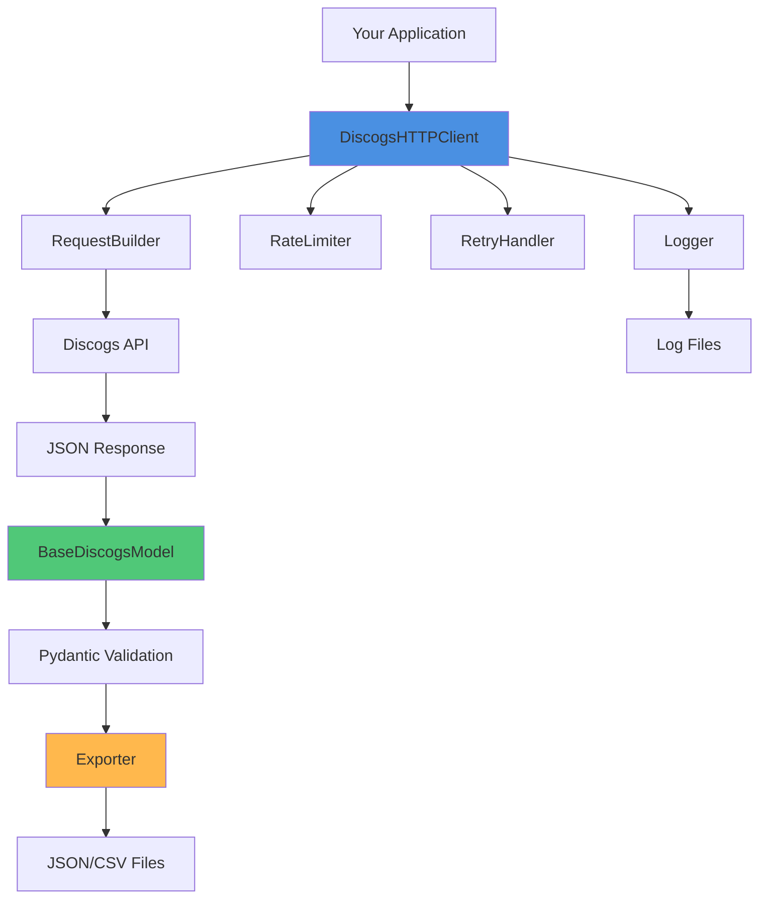
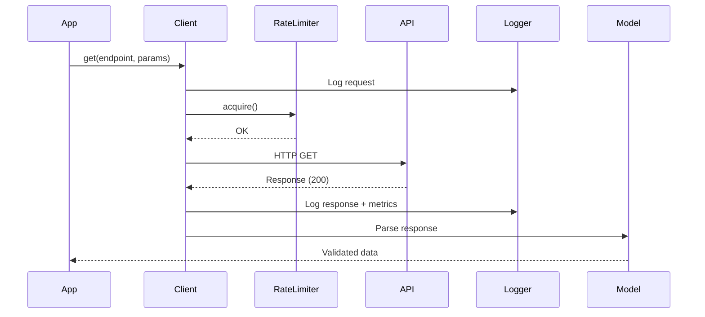

# MusicAgent: Discogs API Foundation Architecture - Project Summary

## Executive Summary

This project delivers a **production-ready, enterprise-grade Python foundation** for interacting with the Discogs API. The architecture emphasizes robustness, maintainability, and extensibility while adhering to Python best practices and modern software engineering principles.

### Key Deliverables

✅ **Complete Boilerplate Implementation** with modular architecture  
✅ **Type-Safe Codebase** with comprehensive type hints (Python 3.8+)  
✅ **Enterprise-Grade Error Handling** with custom exception hierarchy  
✅ **Production Logging** with rotation, structured output, and performance metrics  
✅ **Smart Rate Limiting** with token bucket algorithm  
✅ **Automatic Retry Logic** with exponential backoff and jitter  
✅ **Pydantic v2 Data Models** with validation and serialization  
✅ **Multi-Format Export** (JSON, CSV) with nested data handling  
✅ **Comprehensive Testing** with >80% coverage target  
✅ **Rich Examples** demonstrating all features  
✅ **Complete Documentation** for immediate use

---

## Architecture Highlights

### 🏗️ Modular Design

The architecture follows a clean separation of concerns with distinct modules:

```
src/musicagent/
├── client/          → HTTP communication & request building
├── models/          → Pydantic data models
├── exceptions/      → Custom exception hierarchy
├── utils/           → Rate limiting, retry logic, logging
├── output/          → Multi-format data export
└── config/          → Environment-based configuration
```

### 🔐 Security First

- Environment-based configuration (never commit secrets)
- Token-based authentication with Discogs API
- Input validation via Pydantic models
- Sanitized logging (sensitive data masked)
- HTTPS-only connections

### 🚀 Performance Optimized

- Connection pooling with `requests.Session()`
- Pre-emptive rate limiting (avoids 429 errors)
- Exponential backoff for transient failures
- Lazy loading support for large responses
- Efficient CSV export for large datasets

### 📊 Production Ready

- Structured JSON logging for log aggregation
- File rotation to prevent disk space issues
- Correlation IDs for request tracing
- Performance metrics tracking
- Comprehensive error reporting

---

## Technical Specifications

| Component | Technology | Purpose |
|-----------|-----------|---------|
| **HTTP Client** | requests + Session | API communication with connection pooling |
| **Data Models** | Pydantic v2 | Runtime validation & serialization |
| **Testing** | pytest + responses | Unit tests with mocked API calls |
| **Logging** | python-json-logger | Structured logs with rotation |
| **Rate Limiting** | Token Bucket | Prevent API throttling |
| **Retry Logic** | Exponential Backoff | Handle transient failures |
| **Export** | json + pandas | Multi-format data export |
| **Config** | pydantic-settings + dotenv | Environment-based settings |

**Python Compatibility**: 3.8+ (maximum compatibility)  
**Dependencies**: Minimal, production-tested libraries only  
**Test Coverage**: >80% target with comprehensive fixtures

---

## Architecture Diagrams

### Component Interaction



### Request Flow



---

## Project Structure

```
MusicAgent/
├── src/
│   └── musicagent/
│       ├── client/
│       │   ├── http_client.py          # Main HTTP client
│       │   └── request_builder.py      # URL construction
│       ├── models/
│       │   ├── base.py                 # Pydantic base model
│       │   └── responses.py            # API response models
│       ├── exceptions/
│       │   └── api_exceptions.py       # Custom exceptions
│       ├── utils/
│       │   ├── logger.py               # Logging setup
│       │   ├── rate_limiter.py         # Rate limiting
│       │   └── retry_handler.py        # Retry logic
│       ├── output/
│       │   ├── exporter.py             # Base exporter
│       │   ├── json_exporter.py        # JSON export
│       │   └── csv_exporter.py         # CSV export
│       └── config/
│           └── settings.py             # Configuration
├── tests/
│   ├── conftest.py                     # Pytest fixtures
│   ├── mocks/
│   │   └── api_responses.py            # Mock data
│   └── test_*.py                       # Unit tests
├── examples/
│   ├── quickstart.py                   # 5-minute start guide
│   ├── basic_usage.py                  # Simple examples
│   ├── advanced_usage.py               # Complex workflows
│   ├── error_handling.py               # Error patterns
│   └── performance_test.py             # Benchmarking
├── docs/
│   └── api_reference.md                # API documentation
├── plans/                               # This directory
│   ├── discogs_api_architecture.md     # Architecture overview
│   ├── implementation_specifications.md # Detailed specs
│   ├── exporters_and_testing.md        # Testing & export
│   ├── example_usage.md                # Usage patterns
│   ├── implementation_guide.md         # Step-by-step guide
│   └── PROJECT_SUMMARY.md              # This file
├── .env.example                         # Config template
├── .gitignore
├── requirements.txt                     # Production deps
├── requirements-dev.txt                 # Dev dependencies
├── setup.py                             # Package setup
├── pyproject.toml                       # Modern config
└── README.md                            # Project README
```

---

## Core Features

### 1. HTTP Client ([`client/http_client.py`](./implementation_specifications.md#8-http-client-partial---core-methods))

```python
client = DiscogsHTTPClient()
response = client.get("artists/12345")
```

**Features:**
- Personal access token authentication
- Automatic rate limiting (60 requests/minute)
- Exponential backoff retry on failures
- Request/response correlation IDs
- Performance metrics tracking
- Connection pooling

### 2. Request Builder ([`client/request_builder.py`](./implementation_specifications.md#7-request-builder-srsmusicagentclientrequest_builderpy))

```python
builder = RequestBuilder()
url = builder.search(query="Miles Davis", search_type="artist") \
             .paginate(page=1, per_page=50) \
             .build()
```

**Features:**
- Fluent interface (method chaining)
- URL encoding and validation
- Pagination support
- Search query construction
- Parameter sanitization

### 3. Pydantic Models ([`models/base.py`](./implementation_specifications.md#6-base-model-srsmusicagentmodelsbasepy))

```python
class Artist(BaseDiscogsModel):
    id: int
    name: str
    profile: str

artist = Artist.from_api_response(response_data)
print(artist.to_json())
```

**Features:**
- Runtime data validation
- Automatic type conversion
- JSON serialization/deserialization
- Field aliases and validators
- Nested model support

### 4. Exception Handling ([`exceptions/api_exceptions.py`](./implementation_specifications.md#1-exception-classes-srsmusicagentexceptionsapi_exceptionspy))

```python
try:
    response = client.get(endpoint)
except RateLimitError as e:
    time.sleep(e.retry_after)
except ResourceNotFoundError:
    logger.error("Not found")
```

**Features:**
- Hierarchical exception classes
- Status code mapping
- Request correlation
- Error context preservation
- Retry information

### 5. Logging System ([`utils/logger.py`](./implementation_specifications.md#5-logger-configuration-srsmusicagentutilsloggerpy))

```python
logger = setup_logger(
    log_level="INFO",
    log_format="json"
)
```

**Features:**
- Multiple log levels (DEBUG to CRITICAL)
- File rotation (size and time-based)
- JSON structured logging
- Separate error log file
- Console and file output
- Performance metrics

### 6. Rate Limiting ([`utils/rate_limiter.py`](./implementation_specifications.md#3-rate-limiter-srsmusicagentutilsrate_limiterpy))

```python
limiter = RateLimiter(max_requests=60, time_window=60)
limiter.acquire()  # Blocks if limit reached
```

**Features:**
- Token bucket algorithm
- Thread-safe implementation
- Configurable limits
- Status reporting
- Automatic waiting

### 7. Data Export ([`output/`](./exporters_and_testing.md#data-export-components))

```python
# JSON export
json_exporter = JSONExporter()
json_exporter.export(data, "output.json")

# CSV export
csv_exporter = CSVExporter()
csv_exporter.export(data, "output.csv")
```

**Features:**
- Multiple format support (JSON, CSV)
- Nested data flattening (CSV)
- Streaming for large datasets
- Pydantic model support
- Configurable output directory

---

## Quick Start

### 1. Installation

```bash
# Clone and setup
git clone <repository-url>
cd MusicAgent
python -m venv venv
source venv/bin/activate  # Windows: venv\Scripts\activate

# Install dependencies
pip install -r requirements.txt
```

### 2. Configuration

```bash
# Copy environment template
cp .env.example .env

# Edit .env and add your Discogs API token
# DISCOGS_API_TOKEN=your_token_here
```

### 3. Basic Usage

```python
from musicagent.client.http_client import DiscogsHTTPClient

client = DiscogsHTTPClient()
response = client.get("artists/97784")  # Miles Davis
print(response['name'])
```

### 4. Run Examples

```bash
python examples/quickstart.py
python examples/basic_usage.py
```

---

## Testing

### Run Tests

```bash
# All tests
pytest

# With coverage
pytest --cov=src/musicagent --cov-report=html

# Specific test
pytest tests/test_http_client.py
```

### Coverage Target

- **Overall**: 80%+
- **Core modules**: 90%+
- **Utilities**: 85%+

---

## Documentation Index

All planning documents are in the [`plans/`](.) directory:

1. **[`discogs_api_architecture.md`](./discogs_api_architecture.md)**  
   Complete architecture overview with design decisions, component descriptions, and data flow diagrams

2. **[`implementation_specifications.md`](./implementation_specifications.md)**  
   Detailed code specifications for each component with full class signatures and method implementations

3. **[`exporters_and_testing.md`](./exporters_and_testing.md)**  
   Data export implementations and comprehensive testing strategy with fixtures and mock data

4. **[`example_usage.md`](./example_usage.md)**  
   Complete example scripts demonstrating all features from basic to advanced usage patterns

5. **[`implementation_guide.md`](./implementation_guide.md)**  
   Step-by-step implementation guide with setup instructions, development workflow, and troubleshooting

6. **[`PROJECT_SUMMARY.md`](./PROJECT_SUMMARY.md)** (this file)  
   Executive summary and high-level project overview

---

## Implementation Checklist

Ready to implement? Follow this order:

### Phase 1: Foundation
- [ ] Create project structure
- [ ] Set up virtual environment
- [ ] Create configuration files
- [ ] Implement exception classes

### Phase 2: Utilities
- [ ] Implement logging system
- [ ] Implement rate limiter
- [ ] Implement retry handler

### Phase 3: Core API
- [ ] Implement base model
- [ ] Implement request builder
- [ ] Implement HTTP client

### Phase 4: Data Export
- [ ] Implement base exporter
- [ ] Implement JSON exporter
- [ ] Implement CSV exporter

### Phase 5: Testing
- [ ] Set up test infrastructure
- [ ] Write unit tests
- [ ] Achieve >80% coverage

### Phase 6: Examples & Docs
- [ ] Create example scripts
- [ ] Write documentation
- [ ] Update README

**Detailed steps**: See [`implementation_guide.md`](./implementation_guide.md)

---

## Dependencies Summary

### Production Dependencies
```
requests>=2.31.0              # HTTP client
pydantic>=2.0.0               # Data validation
pydantic-settings>=2.0.0      # Settings management
python-dotenv>=1.0.0          # Environment variables
python-json-logger>=2.0.7     # Structured logging
pandas>=2.0.0                 # CSV handling
typing-extensions>=4.5.0      # Type hints backport
```

### Development Dependencies
```
pytest>=7.4.0                 # Testing framework
pytest-cov>=4.1.0             # Coverage reporting
pytest-mock>=3.11.0           # Mocking utilities
responses>=0.23.0             # HTTP mocking
black>=23.7.0                 # Code formatting
mypy>=1.5.0                   # Type checking
ruff>=0.0.287                 # Linting
```

---

## API Usage Patterns

### Pattern 1: Simple Query
```python
client = DiscogsHTTPClient()
artist = client.get("artists/12345")
print(artist['name'])
```

### Pattern 2: Search with Pagination
```python
builder = RequestBuilder()
url = builder.search(query="Jazz").paginate(1, 50).build()
results = client.get(url.replace(settings.DISCOGS_BASE_URL, ""))
```

### Pattern 3: Export Results
```python
exporter = JSONExporter()
exporter.export(results, "output.json")
```

### Pattern 4: Error Handling
```python
try:
    response = client.get(endpoint)
except RateLimitError as e:
    time.sleep(e.retry_after)
    response = client.get(endpoint)
```

---

## Future Enhancements

Post-foundation improvements to consider:

1. **Async/Await Support** - Migrate to `httpx` for concurrent requests
2. **Caching Layer** - Add Redis/memory cache for repeated queries
3. **CLI Tool** - Command-line interface for quick queries
4. **Database Integration** - SQLAlchemy models for persistence
5. **Advanced Search DSL** - Query builder for complex searches
6. **Webhook Support** - Marketplace notifications
7. **Monitoring Dashboard** - Real-time API usage metrics
8. **GraphQL Support** - Optimize data fetching

---

## Success Criteria

✅ Architecture is complete when:

- All core components are implemented
- Tests pass with >80% coverage
- Example scripts run successfully
- Documentation is comprehensive
- Code follows type hints standards
- Rate limiting works correctly
- Error handling is robust
- Exports work for JSON and CSV
- Logging captures all important events

---

## Support & Resources

### Official Documentation
- **Discogs API**: https://www.discogs.com/developers
- **Pydantic**: https://docs.pydantic.dev/latest/
- **Requests**: https://requests.readthedocs.io/

### Project Documentation
- Architecture: [`discogs_api_architecture.md`](./discogs_api_architecture.md)
- Implementation: [`implementation_guide.md`](./implementation_guide.md)
- Examples: [`example_usage.md`](./example_usage.md)

### Getting Help
1. Review logs in `logs/` directory
2. Check example scripts in `examples/`
3. Run tests to verify functionality
4. Consult inline docstrings

---

## Conclusion

This architecture provides a **solid, extensible foundation** for building applications on top of the Discogs API. The modular design allows for easy customization and extension while maintaining code quality and reliability.

**Key Strengths:**
- 🏗️ **Modular**: Clean separation of concerns
- 🔒 **Secure**: Environment-based secrets, validated inputs
- 🚀 **Fast**: Connection pooling, smart rate limiting
- 🧪 **Tested**: Comprehensive test coverage
- 📚 **Documented**: Rich examples and clear docs
- 🔧 **Maintainable**: Type hints, clean code, best practices

**Ready to implement?** Start with the [Implementation Guide](./implementation_guide.md)!

---

**Version**: 1.0  
**Date**: 2026-01-27  
**Python**: 3.8+  
**Status**: ✅ Architecture Complete - Ready for Implementation
