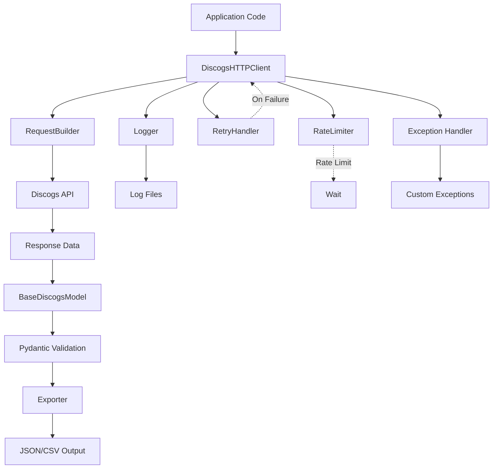
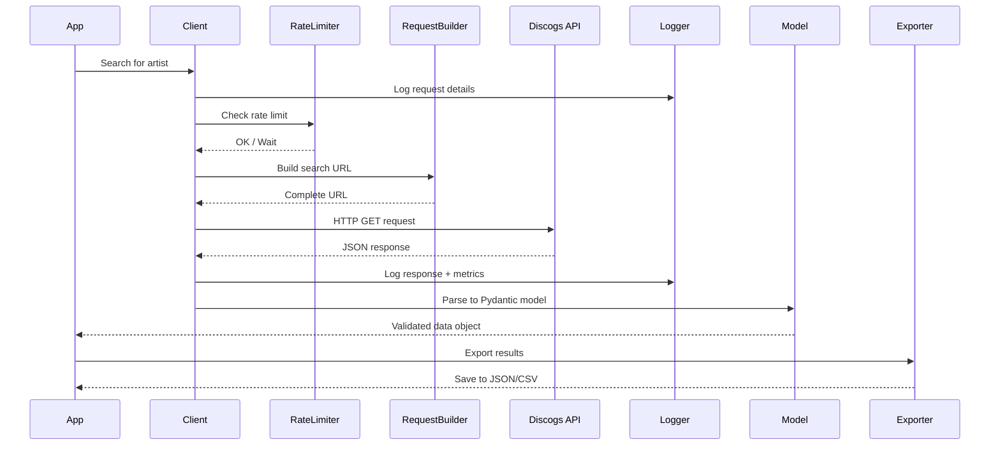

# Discogs API Foundation Architecture Plan

## Overview
This document outlines the foundational architecture for the MusicAgent application, which provides a robust, scalable framework for interacting with the Discogs API. The architecture emphasizes modularity, type safety, comprehensive error handling, and extensive logging capabilities.

## Target Specifications
- **Python Version**: 3.8+ (maximum compatibility)
- **Data Modeling**: Pydantic v2 (runtime validation, JSON handling)
- **Testing Framework**: pytest with fixtures and mocking
- **Key Features**: Authentication, rate limiting, retry logic, structured logging, multi-format export

## Project Directory Structure

```
MusicAgent/
├── src/
│   └── musicagent/
│       ├── __init__.py
│       ├── client/
│       │   ├── __init__.py
│       │   ├── http_client.py          # Main HTTP client with auth, rate limiting, retries
│       │   └── request_builder.py      # URL and query parameter construction
│       ├── models/
│       │   ├── __init__.py
│       │   ├── base.py                 # Abstract base model using Pydantic v2
│       │   └── responses.py            # Example response models (Artist, Release, etc.)
│       ├── exceptions/
│       │   ├── __init__.py
│       │   └── api_exceptions.py       # Custom exception hierarchy
│       ├── utils/
│       │   ├── __init__.py
│       │   ├── logger.py               # Logging configuration and utilities
│       │   ├── rate_limiter.py         # Rate limiting implementation
│       │   └── retry_handler.py        # Retry logic with exponential backoff
│       ├── output/
│       │   ├── __init__.py
│       │   ├── exporter.py             # Abstract exporter interface
│       │   ├── json_exporter.py        # JSON export implementation
│       │   └── csv_exporter.py         # CSV export implementation
│       └── config/
│           ├── __init__.py
│           └── settings.py             # Configuration management
├── tests/
│   ├── __init__.py
│   ├── conftest.py                     # pytest fixtures and configuration
│   ├── mocks/
│   │   ├── __init__.py
│   │   └── api_responses.py            # Mock API response data
│   ├── test_http_client.py
│   ├── test_request_builder.py
│   ├── test_models.py
│   ├── test_exporters.py
│   └── test_logger.py
├── examples/
│   ├── basic_usage.py                  # Simple API call example
│   ├── advanced_usage.py               # Complex queries with export
│   └── error_handling.py               # Error handling patterns
├── logs/                               # Log file directory (gitignored)
├── exports/                            # Export output directory (gitignored)
├── docs/
│   └── api_reference.md                # Auto-generated API documentation
├── .env.example                        # Environment variable template
├── .gitignore
├── requirements.txt
├── requirements-dev.txt                # Development dependencies
├── setup.py                            # Package setup configuration
├── pyproject.toml                      # Modern Python project configuration
├── README.md
└── LICENSE
```

## Core Components Architecture

### 1. HTTP Client Module (`client/http_client.py`)

**Purpose**: Centralized HTTP communication handler with Discogs API

**Key Features**:
- OAuth 1.0a and Personal Access Token authentication
- Automatic rate limiting (Discogs: 60 requests/minute for authenticated)
- Exponential backoff retry mechanism
- Request/response logging with performance metrics
- Session management for connection pooling
- User-Agent header management (required by Discogs)

**Class Structure**:
```python
class DiscogsHTTPClient:
    - __init__(auth_token, user_agent, rate_limit, max_retries)
    - get(endpoint, params)
    - post(endpoint, data)
    - put(endpoint, data)
    - delete(endpoint)
    - _make_request(method, url, **kwargs)
    - _handle_response(response)
    - _check_rate_limit()
```

### 2. Request Builder Module (`client/request_builder.py`)

**Purpose**: Construct valid Discogs API endpoints and manage query parameters

**Key Features**:
- Fluent interface for building requests
- URL encoding and validation
- Pagination support
- Search query construction
- Parameter sanitization

**Class Structure**:
```python
class RequestBuilder:
    - __init__(base_url)
    - search(query, type, **filters)
    - artist(artist_id)
    - release(release_id)
    - master(master_id)
    - user(username)
    - paginate(page, per_page)
    - build()
```

### 3. Base Model Module (`models/base.py`)

**Purpose**: Abstract base for all API response models using Pydantic v2

**Key Features**:
- Automatic JSON serialization/deserialization
- Field validation with type hints
- Custom validators for Discogs-specific fields
- Nested model support
- Export to dict/JSON with exclusion options

**Class Structure**:
```python
class BaseDiscogsModel(BaseModel):
    - model_config (Pydantic v2 configuration)
    - to_dict()
    - to_json()
    - from_api_response(data)
```

### 4. Exception Hierarchy (`exceptions/api_exceptions.py`)

**Custom Exception Classes**:
```python
DiscogsAPIException (base)
├── AuthenticationError
├── RateLimitError
├── ResourceNotFoundError (404)
├── BadRequestError (400)
├── ServerError (500+)
├── NetworkError
└── ValidationError
```

### 5. Logging System (`utils/logger.py`)

**Purpose**: Comprehensive, structured logging with multiple outputs

**Key Features**:
- Multiple log levels (DEBUG, INFO, WARNING, ERROR, CRITICAL)
- File rotation (by size and time)
- JSON-structured log format option
- Request/response correlation IDs
- Performance metrics logging
- Separate error log file
- Console and file handlers

**Configuration**:
```python
class LoggerConfig:
    - log_level: str
    - log_dir: Path
    - log_file_name: str
    - max_bytes: int (10MB default)
    - backup_count: int (5 default)
    - format_type: str (json/text)
```

### 6. Rate Limiter (`utils/rate_limiter.py`)

**Purpose**: Token bucket algorithm for API rate limiting

**Key Features**:
- Configurable requests per time window
- Thread-safe implementation
- Automatic waiting when limit reached
- Rate limit status checking

**Class Structure**:
```python
class RateLimiter:
    - __init__(max_requests, time_window)
    - acquire()
    - wait_if_needed()
    - get_status()
```

### 7. Retry Handler (`utils/retry_handler.py`)

**Purpose**: Exponential backoff retry logic with jitter

**Key Features**:
- Configurable max retries
- Exponential backoff calculation
- Jitter to avoid thundering herd
- Retry on specific status codes
- Circuit breaker pattern

**Decorator**:
```python
@retry_on_failure(max_retries=3, backoff_factor=2)
def api_call():
    pass
```

### 8. Data Output Manager (`output/`)

**Purpose**: Export API responses to multiple formats

**Exporter Interface**:
```python
class BaseExporter(ABC):
    - export(data, filepath)
    - validate_data(data)
```

**Implementations**:
- **JSONExporter**: Pretty-printed, minified, or streaming JSON
- **CSVExporter**: Flat structure with nested field handling

### 9. Configuration Management (`config/settings.py`)

**Purpose**: Centralized configuration with environment variable support

**Key Settings**:
```python
class Settings:
    # API Configuration
    DISCOGS_BASE_URL: str
    DISCOGS_API_TOKEN: Optional[str]
    DISCOGS_USER_AGENT: str
    
    # Rate Limiting
    RATE_LIMIT_REQUESTS: int
    RATE_LIMIT_WINDOW: int
    
    # Retry Configuration
    MAX_RETRIES: int
    RETRY_BACKOFF_FACTOR: float
    
    # Logging
    LOG_LEVEL: str
    LOG_DIR: Path
    LOG_ROTATION_SIZE: int
    
    # Export
    EXPORT_DIR: Path
    DEFAULT_EXPORT_FORMAT: str
```

## Component Interaction Flow



## Data Flow Diagram



## Key Design Decisions

### 1. Pydantic v2 for Data Models
- **Rationale**: Runtime validation, excellent JSON handling, automatic documentation generation
- **Benefits**: Type safety, reduced boilerplate, better error messages
- **Trade-off**: Additional dependency vs built-in dataclasses

### 2. Token Bucket Rate Limiting
- **Rationale**: Discogs enforces 60 requests/minute for authenticated users
- **Implementation**: Pre-emptive rate limiting to avoid 429 errors
- **Benefits**: Smooth request distribution, prevents API blocking

### 3. Exponential Backoff with Jitter
- **Rationale**: Network transient failures are common
- **Implementation**: Retry on 5xx errors and network issues
- **Benefits**: Resilience without overwhelming the API

### 4. Structured JSON Logging
- **Rationale**: Machine-readable logs for monitoring and debugging
- **Implementation**: Optional JSON format with correlation IDs
- **Benefits**: Easy log aggregation, better observability

### 5. Abstract Exporter Pattern
- **Rationale**: Support multiple output formats
- **Implementation**: Base class with format-specific implementations
- **Benefits**: Easy to add new formats, consistent interface

### 6. Environment-Based Configuration
- **Rationale**: Separate configuration from code
- **Implementation**: .env files with Settings class
- **Benefits**: Security, flexibility across environments

## Dependencies (requirements.txt)

```
# Core HTTP and API
requests>=2.31.0
requests-oauthlib>=1.3.1

# Data Modeling and Validation
pydantic>=2.0.0
pydantic-settings>=2.0.0

# Environment Configuration
python-dotenv>=1.0.0

# Logging Enhancements
python-json-logger>=2.0.7

# Data Export
pandas>=2.0.0  # For CSV handling with complex data

# Type Hints (Python 3.8 compatibility)
typing-extensions>=4.5.0

# Development Dependencies (requirements-dev.txt)
pytest>=7.4.0
pytest-cov>=4.1.0
pytest-mock>=3.11.0
responses>=0.23.0  # Mock HTTP responses
faker>=19.0.0  # Generate test data
black>=23.7.0
mypy>=1.5.0
ruff>=0.0.287
```

## Testing Strategy

### Unit Tests
- **HTTP Client**: Mock all external API calls using `responses` library
- **Request Builder**: Test URL construction and parameter encoding
- **Models**: Validate Pydantic schemas with various input data
- **Rate Limiter**: Test timing and thread safety
- **Exporters**: Verify output format correctness

### Test Fixtures (conftest.py)
```python
@pytest.fixture
def mock_discogs_client():
    # Returns configured client with mocked responses

@pytest.fixture
def sample_artist_response():
    # Returns mock JSON for artist endpoint

@pytest.fixture
def rate_limiter():
    # Returns configured rate limiter for testing
```

### Mock API Responses
- Artist search results
- Release details
- Error responses (400, 401, 404, 429, 500)
- Pagination examples
- Rate limit headers

## Error Handling Strategy

### 1. HTTP Status Code Mapping
- 400: BadRequestError - Invalid parameters
- 401: AuthenticationError - Invalid/missing token
- 404: ResourceNotFoundError - Endpoint doesn't exist
- 429: RateLimitError - Too many requests (trigger retry with backoff)
- 5xx: ServerError - Discogs server issues (trigger retry)

### 2. Network Error Handling
- Connection timeouts
- DNS resolution failures
- SSL/TLS errors

### 3. Validation Error Handling
- Pydantic validation failures
- Malformed JSON responses
- Missing required fields

## Performance Considerations

### 1. Connection Pooling
- Use `requests.Session()` for connection reuse
- Reduces overhead for multiple requests

### 2. Lazy Loading
- Don't parse full response if only specific fields needed
- Support partial model population

### 3. Async Future Enhancement
- Current implementation is synchronous
- Architecture supports future async/await conversion
- Use `httpx` instead of `requests` when migrating

### 4. Caching Strategy
- Consider implementing response caching for repeated queries
- Use TTL-based cache for artist/release lookups

## Security Best Practices

1. **Never commit API tokens**: Use `.env` files (in `.gitignore`)
2. **Validate all inputs**: Pydantic models prevent injection
3. **HTTPS only**: Enforce secure connections
4. **Token rotation**: Support for updating credentials without restart
5. **Sanitize logs**: Mask sensitive data in log output

## Example Usage Patterns

### Basic Artist Search
```python
from musicagent.client import DiscogsHTTPClient
from musicagent.models.responses import ArtistSearchResponse

client = DiscogsHTTPClient()
response = client.search_artist("Miles Davis")
artists = ArtistSearchResponse.from_api_response(response)

for artist in artists.results:
    print(f"{artist.name} - {artist.id}")
```

### Export Results to CSV
```python
from musicagent.output import CSVExporter

exporter = CSVExporter()
exporter.export(artists.results, "exports/artists.csv")
```

### Error Handling Pattern
```python
from musicagent.exceptions import RateLimitError, ResourceNotFoundError

try:
    release = client.get_release(12345)
except ResourceNotFoundError as e:
    logger.error(f"Release not found: {e}")
except RateLimitError as e:
    logger.warning(f"Rate limited, waiting...")
    time.sleep(e.retry_after)
```

## Next Steps for Implementation

This architecture provides the foundation for a robust Discogs API client. After reviewing this plan, the implementation phase will:

1. Set up the project structure with all directories
2. Implement each module following the specifications above
3. Create comprehensive unit tests with >80% coverage target
4. Write example scripts demonstrating common use cases
5. Document all public APIs with docstrings
6. Set up development tools (linting, formatting, type checking)

## Future Enhancements (Post-Foundation)

- Async/await support for concurrent requests
- GraphQL-style query optimization
- Response caching layer with Redis
- CLI tool for quick queries
- Webhook support for marketplace notifications
- Database integration for persistent storage
- Real-time monitoring dashboard
- Advanced search DSL

---

**Document Version**: 1.0  
**Last Updated**: 2026-01-27  
**Python Compatibility**: 3.8+  
**Status**: Ready for Implementation Review
